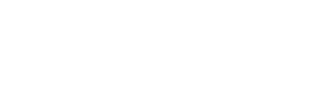

<!-- markdownlint-disable -->
<div align="center">
  
</div>
<div align="center">
  
</div>
<div align="center">
<br />
<!-- markdownlint-restore -->


[](https://discord.gg/ExzzfTGUnB)


⚠️ Work in progress ⚠️
🚨 Now in Beta 🚨

</div>

Welcome to Pallad an experimental and progressive Mina Protocol wallet!

In the vast and evolving world of Web3, a wallet is not just a tool; it's the gateway to a whole new universe. It's the first consumer application anyone encounters in a blockchain ecosystem, and it's pivotal in shaping the user experience. That's where Pallad steps in!

Pallad is at the frontier, leading the way in innovation and user-centric design. We're not just building a wallet; we're crafting the cornerstone of zero-knowledge application interaction design. With Pallad, you're stepping into the future.

## Getting Started 🚀

### Prerequisite 📌

- [NVM](https://github.com/nvm-sh/nvm)
- pnpm

### Installation 💻

Make sure you're on the right Node.js version, and you got pnpm installed.

```shell
$ nvm use
$ npm i -g pnpm
```

Install the dependencies:

```shell
$ pnpm i
```

From `apps/extension` copy the `.env.example` as `.env` and adjust the variables there.

Build all the modules in repo:

```shell
$ pnpm build
```

## Structure 🏗️

This is a monorepo for all the Pallad-related code.

- `apps`
  - `extension` - Browser extension app.
- `packages`
  - `_template` - Template to follow for new packages in this repo.
  - `common` - Common configuration for packages (tsup and vitest).
  - `features` - Wallet features, views, and UI components.
  - `key-management` - Blockchain agnostic key management.
  - `mina-core` - Core Mina Package SDK.
  - `mina-graphql` - GraphQL API client for the Mina Protocol.
  - `multi-chain-core` - Foundation for hosting multiple blockchains.
  - `offchain-data` - Client for fetching off-chain data like fiat price.
  - `persistence` - Persistence logic for wallet related data.
  - `util` - Shared util functions for other packages.
  - `vault` - Credentials storage.
  - `web-provider` - Web provider to consume wallet interfaces in browser context.

## Development 🛠️

Set up the dev server of extension:

```shell
$ pnpm dev:extension
```

## Testing 🧪

Running linter:

```shell
$ pnpm lint
```

Running unit tests (Vitest):

```shell
$ pnpm test:unit
```

Running E2E tests for browser extension (Playwright):

```shell
$ npx playwright install chromium # make sure you have Chromium driver
$ pnpm test:e2e:extension
```

## Contributors ✨

Thanks goes to these wonderful people
([emoji key](https://allcontributors.org/docs/en/emoji-key)):

<a href="https://github.com/palladians/pallad/graphs/contributors">
<!-- ALL-CONTRIBUTORS-LIST:START - Do not remove or modify this section -->
<!-- prettier-ignore-start -->
<!-- markdownlint-disable -->
<table>
  <tbody>
    <tr>
      <td align="center" valign="top" width="14.28%"><a href="https://github.com/mrcnk"><br /><sub><b>Tomek Marciniak</b></sub></a><br /><a href="https://github.com/palladians/pallad/commits?author=mrcnk" title="Code">💻</a></td>
      <td align="center" valign="top" width="14.28%"><a href="https://github.com/teddyjfpender"><br /><sub><b>Teddy Pender</b></sub></a><br /><a href="https://github.com/palladians/pallad/commits?author=teddyjfpender" title="Code">💻</a></td>
      <td align="center" valign="top" width="14.28%"><a href="https://dev.to/rgolawski"><br /><sub><b>Rafał Goławski</b></sub></a><br /><a href="https://github.com/palladians/pallad/commits?author=rago4" title="Code">💻</a></td>
    </tr>
  </tbody>
</table>

<!-- markdownlint-restore -->
<!-- prettier-ignore-end -->

<!-- ALL-CONTRIBUTORS-LIST:END -->
</a>

## Contributing 🤝

We specified contributing guidelines. Please refer to them before starting contributing to this repository.

[Contributing Guidelines](https://github.com/palladians/pallad/blob/main/CONTRIBUTING.md)

## Links 🌍

[pallad.xyz - The official website of Pallad](https://pallad.xyz/)

[Ladle](https://palladians.github.io/pallad/)

[Discord](https://discord.gg/ExzzfTGUnB)
