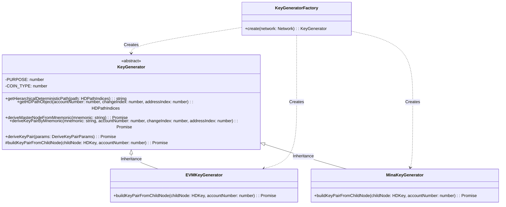

# Cryptocurrency Key Generator

This TypeScript package allows you to generate cryptocurrency keys for multiple networks, such as Ethereum, Mina, and Polygon.

## Table of Contents
1. [Files](#files)
2. [Package Class Structure and Interactions Diagram](#package-class-structure-and-interactions-diagram)
3. [Usage](#usage)
4. [Contributing](#contributing)
5. [License](#license)

## Files

The package contains the following main files:
* `keyGenerator.ts`: This is an abstract base class that defines the common interface and methods used by all key generators.
* `emv.ts`: This file contains the Ethereum (and Polygon) key generator, which extends the base key generator.
* `mina.ts`: This file contains the Mina key generator, which extends the base key generator.
* `KeyGeneratorFactory.ts`: This file contains a factory class used to create instances of key generators based on the desired network.

## Package Class Structure and Interactions Diagram

This diagram depicts the inheritance relationship between the `KeyGenerator`, `EVMKeyGenerator`, and `MinaKeyGenerator` classes, and the responsibility of the `KeyGeneratorFactory` class for creating instances of these classes.



## Usage

Use the `KeyGeneratorFactory` to create an instance of the key generator you need.

```ts
import { KeyGeneratorFactory, Network } from '@pallad/key-generator'

const keyGenerator = KeyGeneratorFactory.create(Network.Mina)
```

You can then use this instance to derive keys:

```ts
const keys = await keyGenerator.deriveKeyPair({ mnemonic: 'habit hope tip crystal because grunt nation idea electric witness alert like' })
```

## Contributing

Contributions are welcome. Please submit a pull request or open an issue for any improvements or bug fixes.

