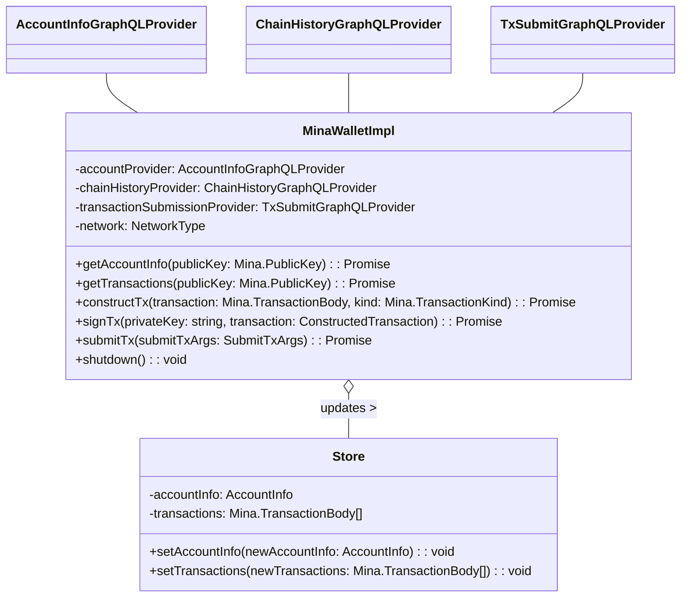

# @palladxyz/mina-wallet

This is a TypeScript library that offers functionalities to interact with Mina protocol. It provides services to retrieve account information, fetch transactions, construct transactions, sign transactions, and submit transactions for the Mina blockchain network.

## Installation

To add this package to your project, you can use npm:

```bash
npm install @palladxyz/mina-wallet
```

or with yarn:

```bash
yarn add @palladxyz/mina-wallet
```

## Key Classes and Methods

`MinaWalletImpl`: This is the main class in the package and is an implementation of the `MinaWallet` interface.

It provides the following methods:

- `getAccountInfo(publicKey: Mina.PublicKey)`: Fetches account information.
- `getTransactions(publicKey: Mina.PublicKey)`: Fetches transactions for the provided public key.
- `constructTx(transaction: Mina.TransactionBody, kind: Mina.TransactionKind)`: Constructs a transaction.
- `signTx(privateKey: string, transaction: ConstructedTransaction)`: Signs a transaction.
- `submitTx(submitTxArgs: SubmitTxArgs)`: Submits a transaction.
- `shutdown()`: Shuts down the wallet.

## Usage

Here is an example of how to use the MinaWallet:

```typescript
import { MinaWalletImpl, ... } from '@palladxyz/mina-wallet';
import { AccountInfoGraphQLProvider, ChainHistoryGraphQLProvider, TxSubmitGraphQLProvider } from '@palladxyz/mina-graphql';
import { NetworkType } from '@palladxyz/tx-construction';

const accountProvider = new AccountInfoGraphQLProvider(...);
const chainHistoryProvider = new ChainHistoryGraphQLProvider(...);
const transactionSubmissionProvider = new TxSubmitGraphQLProvider(...);
const network = NetworkType.MAINNET;

const minaWallet = new MinaWalletImpl(accountProvider, chainHistoryProvider, transactionSubmissionProvider, network);
```

## Diagram



## TODO

- KMS
