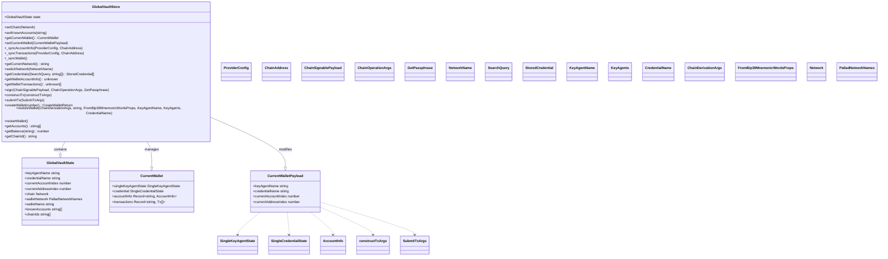

# Vault Store

## Overview
The Pallad Vault is a storage system for the Pallad browser extension. It provides a means to manage various aspects of a the wallet including accounts, transactions, credentials, and network configurations.

## Features
- Multi-network Support: Compatible with different blockchain networks.
- Credential Management: Secure storage for wallet credentials.
- Dynamic Account Management: Functions to manage and switch between multiple accounts.
- Transaction Management: Tools to construct, sign, and submit transactions.
- Synchronization Utilities: Sync account information and transactions automatically.

## Key Components
- `GlobalVaultStore`: The main interface for all vault operations.
- `GlobalVaultState`: Stores the state of the vault including current network, wallet information, and known accounts.

## Key Methods
- `createWallet()`: Create a new wallet with a mnemonic.
- `restoreWallet()`: Restore a wallet from a mnemonic.
- `switchNetwork()`: Change the active blockchain network.
- `sign()`: Sign a transaction or message.
- `submitTx()`: Submit a transaction to the blockchain.

## Architecture 

